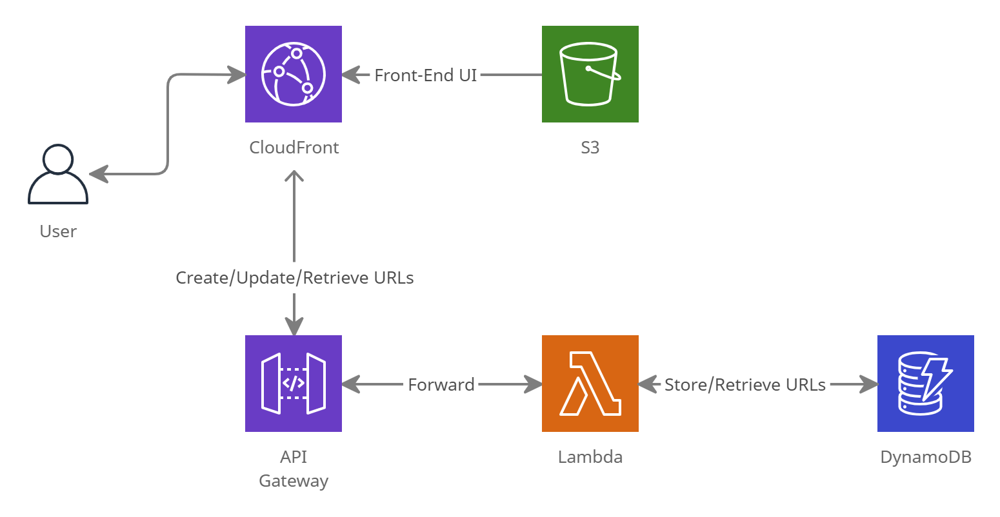

## URL Shortener AWS deployment
This repo contains the lambda functions that handle the requests for create/update/retreive the short URL.
It implmemented the store using AWS DynamoDB as backend data store.

## Architecture
The project uses full stack of aws managed service to provide high availability and scaling capability.
<p align="center">
  
  <br/>
</p>

## Project Structure
```
+-- core
| git submodule point to the url-shortener-core
+-- static
| static files like js/html for frontend UI
+-- store
|  dynamodb_store.py #dynamodb implementation of backend store
+-- tests
|   unit test cases files
createShortURL.py #lambda function to call core api for create short url token
retrieveShortURL.py #lambda function to call core api for retrieve original url and redirect
updateShortUrl.py #lambda function to call core api for update original url given for a short url token
```

## Setup
This is deployed to AWS.

Visit https://www.sggti.net/ to play.
